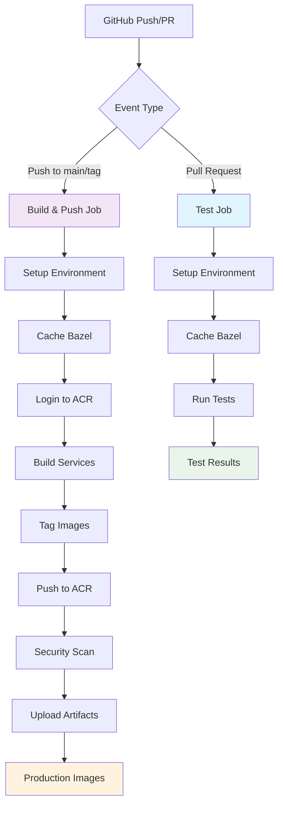

# Azure CI/CD Pipeline Architecture

## Pipeline Flow



## Service Architecture

```
bidding-auction-servers/
├── services/
│   ├── auction_service/          → auction_service:latest
│   ├── bidding_service/          → bidding_service:latest  
│   ├── buyer_frontend_service/   → buyer_frontend_service:latest
│   └── seller_frontend_service/  → seller_frontend_service:latest
│
├── production/packaging/azure/
│   ├── ci.yml                   # GitHub Actions workflow
│   ├── lib_azure_artifacts.sh   # Azure build functions
│   ├── Dockerfile              # Build container
│   ├── README.md               # Setup guide
│   ├── SECURITY.md             # Security practices
│   ├── test_setup.sh           # Validation script
│   └── local_test.sh           # Local dev script
│
└── .bazelrc.ci                 # CI optimization
```

## Build Matrix

| Service | Docker Image | Container Registry |
|---------|--------------|-------------------|
| Auction Service | `{registry}/auction_service:{tag}` | Azure ACR |
| Bidding Service | `{registry}/bidding_service:{tag}` | Azure ACR |
| Buyer Frontend | `{registry}/buyer_frontend_service:{tag}` | Azure ACR |
| Seller Frontend | `{registry}/seller_frontend_service:{tag}` | Azure ACR |

## Tagging Strategy

| Trigger | Tag Format | Example |
|---------|------------|---------|
| Commit to main | `{service}:latest` | `auction_service:latest` |
| Commit SHA | `{service}:{sha}` | `auction_service:abc1234` |
| Git tag | `{service}:{tag}` | `auction_service:v1.0.0` |
| Development | `{service}:{git-describe}-{flavor}` | `auction_service:v1.0.0-5-gabc123-prod` |

## Performance Features

- **Bazel Caching**: 50-70% build time reduction
- **Docker Layer Caching**: Efficient image builds  
- **Parallel Jobs**: Tests and builds run independently
- **Incremental Builds**: Only changed components rebuilt
- **Remote Cache Ready**: Configurable remote Bazel cache

## Security Features

- **Vulnerability Scanning**: Trivy integration
- **Secret Management**: GitHub encrypted secrets
- **Image Signing**: Ready for cosign integration
- **RBAC**: Least-privilege service principal
- **Audit Trail**: Complete build provenance